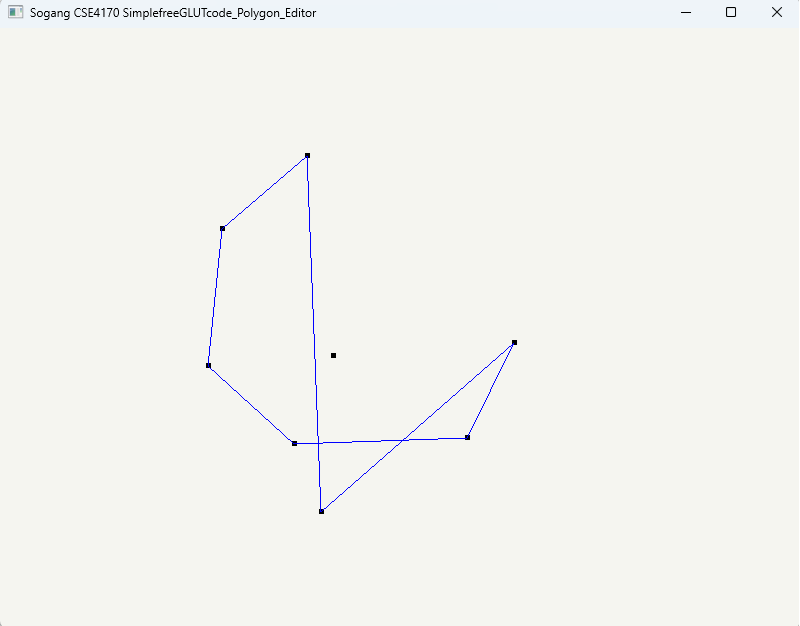
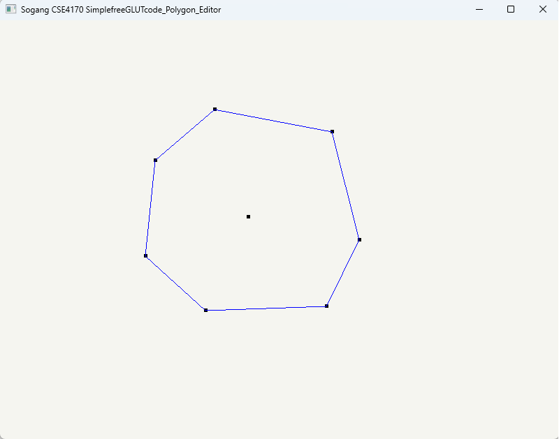
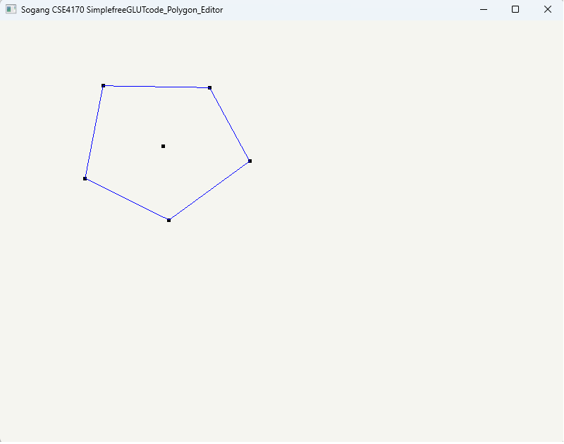
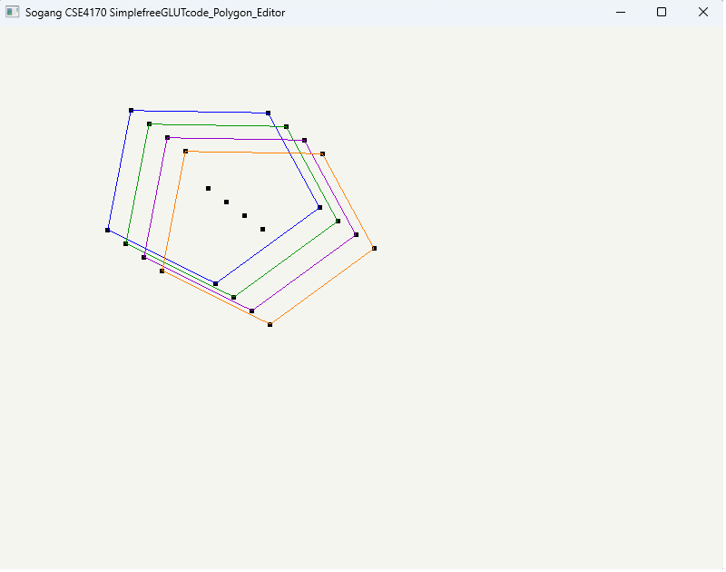
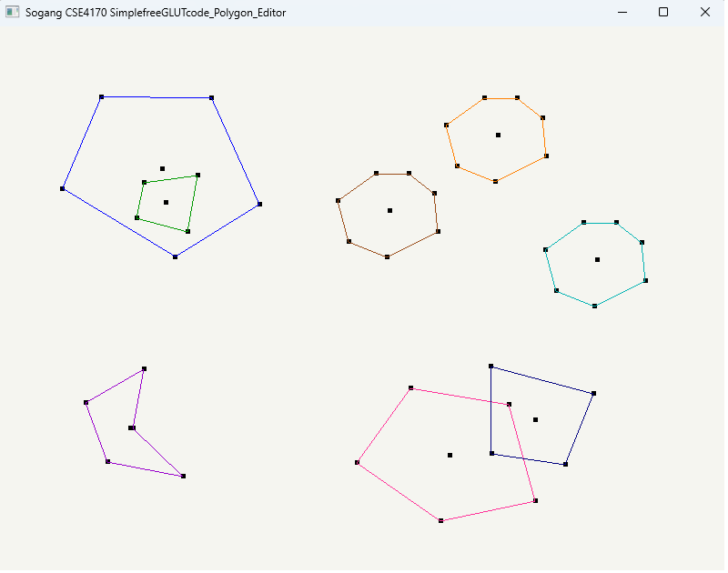
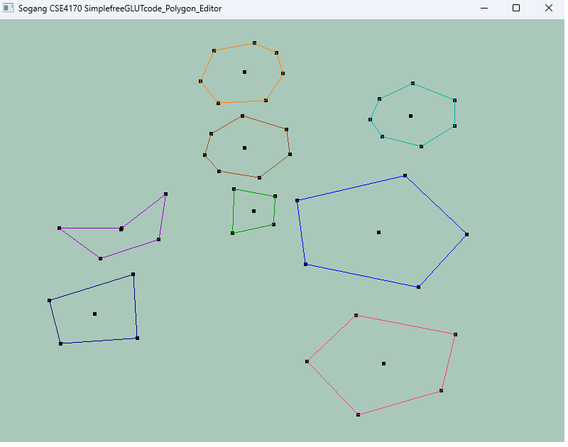

# HW1: GLUT 툴킷을 사용한 Polygon Editor 개발

20210041 박민성

1)  프로그램 실행 시 호출되는 initialize\_polygon\_editor() 함수에서 상태 구조체의
    st.current\_mode를 IDLE로 초기화합니다.

2)  s키를 입력받으면 CREATION모드로 전환합니다. My\_Polygon 배열을 순회하여 빈 인덱스를 찾아 다각형의
    꼭지점을 저장합니다. e키를 입력받았을 때 점이 3개 이상 입력되어 다각형이 완성되었다면 다시 IDLE모드로
    복귀합니다.

3)  e키를 입력받아 다각형이 완성될 때, update\_center\_of\_gravity()를 호출하여 무게중심을
    계산합니다.

4)  다각형의 선분 색깔을 const float PALLETE\[MAX\_POLYGONS\]\[3\]를 선언해 색상 팔레트로
    관리합니다. 다각형이 생성될 때 다각형의 인덱스에 맞는 색상을 PALLETE에서 찾아 저장합니다.

5)  IDLE모드에서 마우스를 좌클릭하면, 마우스의 NDC좌표와 각 다각형의 무게 중심 사이의 거리를 계산합니다. 거리가
    CENTER\_SELECTION\_SENSITIVITY 이내일 경우 SELECTION모드로 전환하고, 해당 다각형의
    무게중심점 색을 빨간색으로 변경합니다.

6)  SELECTION모드에서 현재 선택된 다각형의 무게 중심을 다시 좌클릭하면 IDLE모드로 전환하고, 해당 다각형의
    무게중심적 색을 검정색으로 변경합니다.

7)  SLECTION모드에서 c키를 입력받으면 선택된 다각형의 is\_active 플래그를 0으로 만들어 렌더링 시 화면에서
    제거하고 IDLE모드로 복귀합니다.

8)  SELECTION모드에서 마우스를 좌클릭한 채로 드래그하는 경우를 mousemove 콜백에서 확인합니다. 마우스의 이동량을
    NDC기준으로 계산한 뒤, move\_point()를 통해 다각형의 모든 꼭지점과 무게 중심점을 이동시킵니다.

9)  SELECTION모드에서 마우스를 우클릭한 채로 드래그하는 경우를 mousemove 콜백에서 확인합니다. 마우스의 X축
    기준 변화량을 회전 각도로 변경합니다.
    rotate\_points\_around\_center\_of\_gravity() 함수에서 다각형을 무게 중심 기준으로
    원점으로 옮기고 회전 변환 행렬을 곱해 회전시키고 다시 원래 위치로 이동합니다.

10) wheel 콜백 함수가 호출되면, 휠 스크롤 방향에 따라 지정된 비율
    SCALE\_UP\_FACTOR/SCALE\_DOWN\_FACOR만큼 크기를 확대/축소합니다.

11) SELECTION모드에서 A키를 입력받으면 ANIMATION모드로 전환합니다. 16ms주기로 glutTimerFunc가
    작동해 타이머 내부에서 도형을 회전시키며 도형의 크기를 기존 크기의 0.5\~1.5배 사이로 축소/확대시킵니다.

12) ANIMATION모드 중 A키를 입력받으면 SELECTION모드로 변경하고, 애니메이션을 정지합니다.

13) display() 함수 내부에서 st.current\_mode에 따라 glClearColor에 전달하는 배경색을 다르게
    설정해, 배경색의 변화로 모드 변경을 확인합니다.

14) 추가 구현 기능

<!-- end list -->

1)  다각형 꼭지점 드래그를 통한 모양 변형

> SELECTION 모드에서 선택한 다각형의 꼭지점을 마우스 좌클릭 후 드래그하면 마우스의 위치로 해당 꼭지점이 이동합니다.
> 무게 중심도 변형된 다각형에 맞게 갱신합니다.
> 
> 
> 

2)  다각형 복제

> SELECTION 모드에서 d키를 입력받으면 선택한 다각형을 복제한 새로운 다각형을 생성합니다. 연속해서 d키를 누를 경우
> 복제본들이 겹치지 않도록 오프셋을 두고 생성됩니다.
> 
> 
> 

3)  AABB기반 Bouncing 애니매이션 구현

> IDLE모드에서 B키를 누르면 생성된 모든 다각형들이 회전하며 이동합니다. 다른 다각형과 충돌하거나 윈도우 경계에 닿을 경우
> 이동 방향과 회전 방향을 바꿉니다. 충돌 판정은 오목다각형을 고려하여 Axis-Aligned Bouncing Box를
> 사용하여 판정합니다. 애니메이션 시작 시 서로 겹쳐서 생성된 다각형들을 확인하여 모두 떨어뜨리고 애니메이션을
> 시작합니다.
> 
> 
> 
