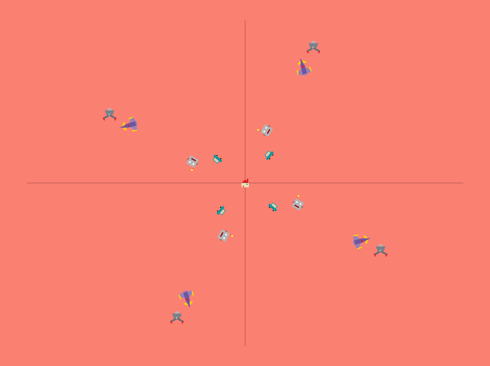
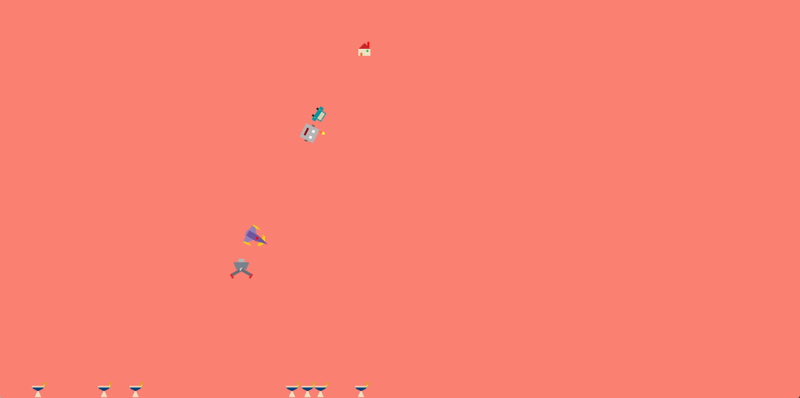
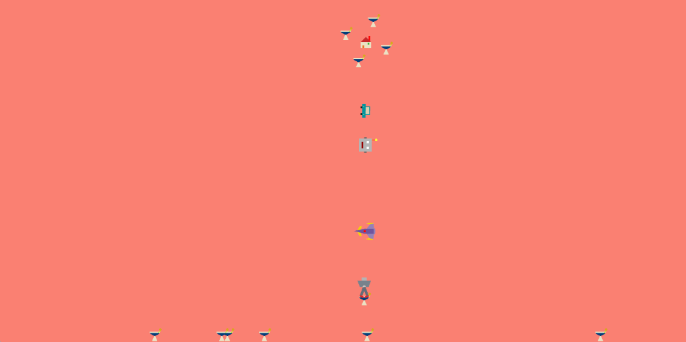

# HW2: OpenGL을 사용한 2차원 계층적 모델링 변환 연습

1)  Level 0 물체는 house, Level 1 물체는 car, Level 3 물체는 airplane을 사용해서
    구현했습니다.

2)  마우스로 Level 0 물체를 클릭했는지 NDC기준으로 확인하고, Level 0 물체를 클릭한 상태에서 마우스를
    드래그하면, 마우스의 위치로 Level 0 물체가 이동하도록 구현했습니다.

3)  전역변수 active\_lv1을 사용하여 키보드 ‘1’키를 입력받으면, Level 1의 움직임 상태를 토글할 수 있도록
    설정했습니다. Level 1의 시간을 계산하는 active\_timestamp\_lv1을 전체 timestamp와
    독립적으로 설정해서 Level 1의 timestamp는 active\_lv1이 true인 경우에만 증가하도록
    구현했습니다.

4)  전역변수 active\_lv4를 사용하여 키보드 ‘4’키를 입력받으면, Level 4의 움직임 상태를 토글할 수 있도록
    설정했습니다. Level 3의 scale이 움직임에 따라 변하는데, 조건(e)를 토대로 이는 Level 3만의
    고유한 크기 변환이라고 판단하였습니다. 이에 맞춰서 active\_lv4가 false라도 Level 4의 크기는
    Level 3의 크기와는 상관없이 고유한 크기를 유지할 수 있도록 구현했습니다.

5)  Level 3 물체의 크기를
    $scale = 1.0 + 0.25 \cdot sin(3.0 \cdot radian\left( t \right))$으로 설정하여,
    timestamp에 따라 크기가 75%에서 125%사이로 축소/확대될 수 있도록 구현했습니다.

6)  각 Level의 물체 이동 방식은 아래와 같습니다. (과제 구현을 명세서 수정 이전에 시작해 전체 계층은 Level 5까지
    6단계로 설정하였습니다.)  
    Level 1: Level 0을 기준으로 하는 4개 물체의 원 운동  
    Level 2: Level 1을 기준으로 $x = 80.0 \cdot \cos\left( t \right)$,
    $y = 80.0 \cdot \sin\left( 3.0 \cdot \ t \right)$의 파형 운동  
    Level 3: Level 2를 기준으로 Level 2와의 offset이
    $x = 200.0 + 40.0 \cdot \sin\left( 2.0 \cdot t \right)$로 변하면서 회전하는 운동.  
    Level 4: Level 1부터 Level 3까지 모든 부모의 rotate에 대한 영향을 상쇄시켜 항상 crane이
    아래를 볼 수 있게 하는 운동  
    Level 5: $angle = 40.0 + 20.0 \cdot sin(t)$로 Level 4의 중심 좌표 기준으로
    crane\_arm의 각도가 변하는 운동

7)  Level 2는 로봇의 얼굴을 형상화, Level 4는 집게의 몸체, Level 5는 대칭으로 양쪽 집게 팔을 형상화해
    구현했습니다.

8)  키보드로 ‘g’키를 입력받으면 현재 모드를 BASE에서 CRANE으로 전환하여 화면 바닥에 있는 물체를 space를 이용해
    잡을 수 있도록 합니다.

> Level 0 물체는 x축에 평행하게 이동하며, 나머지 Level 1\~Level 4의 물체들은 기존의 운동을 진행합니다.
> space키를 입력받으면, 선형 보간을 통해 Level 1부터Level 4까지의 물체들이 Level 0 물체 기준으로 수직으로
> 정렬된 후, Level 4의 집게가 아래로 내려가도록 하였습니다. Level 4의 집게가 화면 바닥에 도달했을 때, 크레인의
> x좌표와 바닥 물체의 x좌표가 20.0f 미만이라면, 해당 물체를 Level 4에 종속되도록 하여 잡아 올릴 수 있도록
> 구현했습니다. 잡아 올린 물체들은 Level 0 주위를 회전하도록 구현했습니다.
> 
> 바닥에 있는 물체들은 2초마다 랜덤으로 생성되어, 화면에 15초동안 유지되고, 사라지기 5초 전부터 점멸하다 사라지도록
> 설정했습니다.
