# HW3: OpenGL API를 사용한 3D 뷰잉 연습

20210041 박민성

1.  정적 카메라의 배치 및 조절 기능 구현

<!-- end list -->

1)  세상 관찰 카메라

<!-- end list -->

  - Camera\_u

> 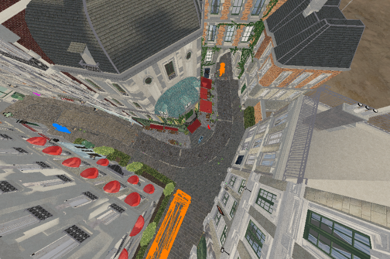

  - Camera\_I

> 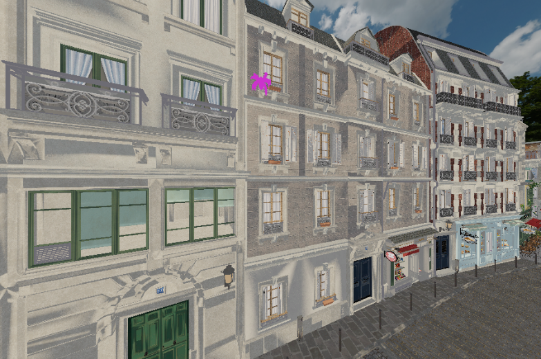

  - Camera\_O

> 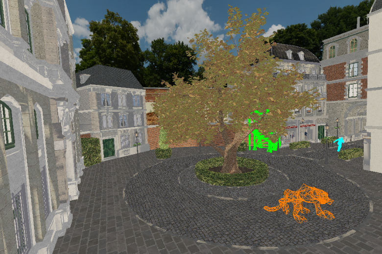

  - Camera\_P

> 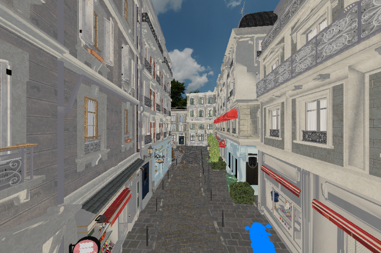

  - ‘u’, ‘I’, ‘o’, ‘p’ 키를 누르면 각각 Camera\_u, Camera\_i, Camera\_o,
    Camera\_p로 전환됩니다.

  - CTRL 키를 누른 상태에서 마우스 휠을 사용하면 fovy를 변경하여 줌인/줌아웃이 됩니다.

  - CTRL 키를 누른 상태에서 마우스를 위아래로 움직이면 uaxis를 기준으로 vaxis와 naxis를 회전시켜 카메라의
    pitch동작을 구현했습니다.

  - CTRL 키를 누른 상태에서 마우스를 좌우로 움직이면 vaxis를 기준으로 uaxis와 naxis를 회전시켜 카메라의
    yaw동작을 구현했습니다.

<!-- end list -->

2)  세상 이동 카메라

<!-- end list -->

  - Camera\_a

> 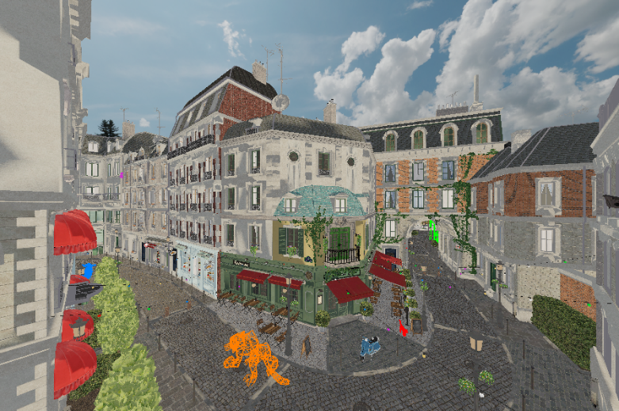

  - ‘a’ 키를 누르면 Camera\_a로 전환됩니다.

  - 전진/후진: 방향키 ‘↑’ / ’↓’으로 카메라 naxis의 역방향/정방향으로 이동합니다.

  - 좌/우 이동: 방향키 ‘←’ / ‘→’으로 카메라 uaxis 방향으로 이동합니다.

  - 상/하 이동: ‘q’ / ‘e’ 키로 카메라 vaxis의 역방향/정방향으로 이동합니다.

  - u축 회전: CTRL 키를 누른 상태에서 마우스를 위아래로 움직이면 uaxis 기준으로 vaxis와 naxis를
    회전시킵니다.

  - v축 회전: CTRL 키를 누른 상태에서 마우스를 좌우로 움직이면 vaxis 기준으로 uaxis와 vaxis를
    회전시킵니다.

  - n축 회전: ‘z’ / ‘x’ 키로 naxis 기준으로 uaxis와 vaxis를 반시계/시계 방향으로 회전시킵니다.

  - CTRL키를 누른 상태에서 마우스 휠을 사용하면 fovy를 변경하여 줌인/줌아웃이 됩니다.

<!-- end list -->

2.  물체의 배치 및 움직임 구현

<!-- end list -->

1)  정적 물체의 배치

<!-- end list -->

  - 버스

> 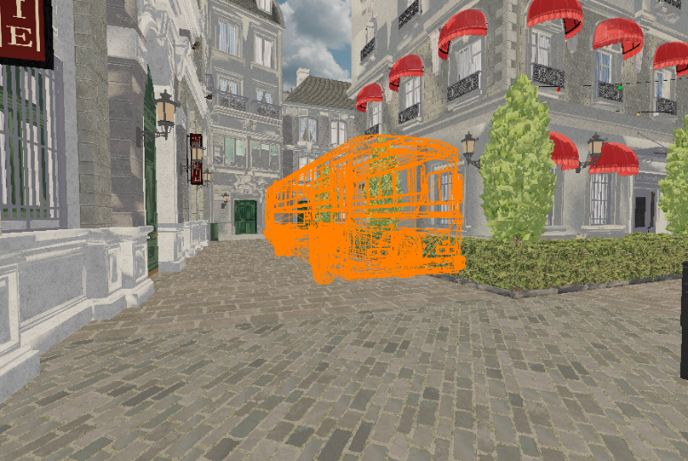

  - 타워

> 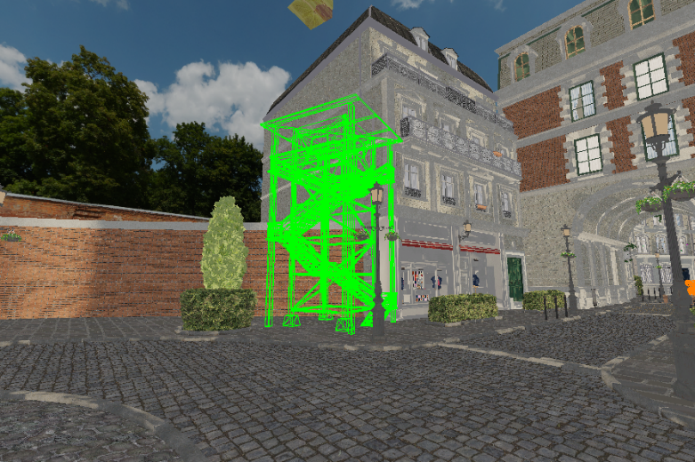

  - 오토바이

> 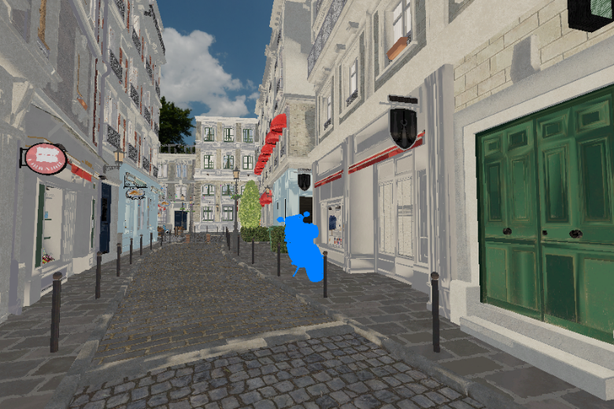

  - 개미

> 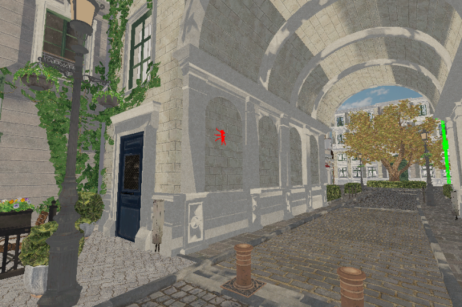

  - 고양이

> 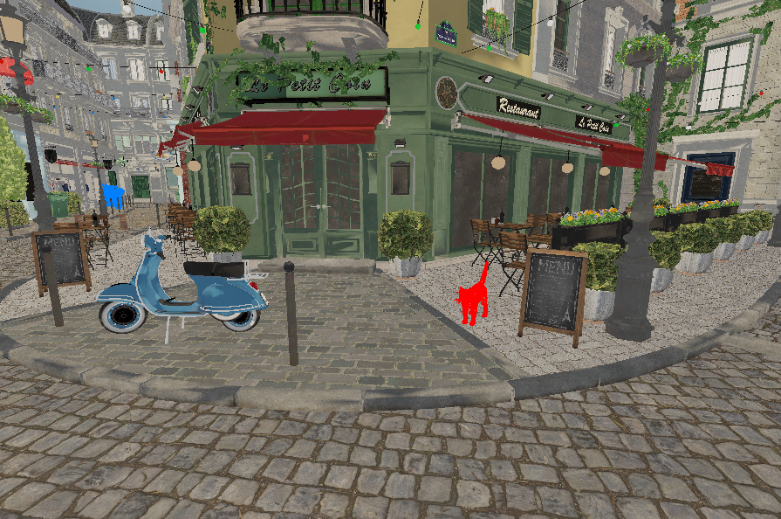

2)  동적 물체의 배치

<!-- end list -->

  - 호랑이는 N\_TIGER\_WAYPOINTS(25)개의 경유지를 지정하여, 도로를 따라 이동하도록 구현했습니다.
    Catmull-Rom Splines을 사용하여 각 경유지를 매끄럽게 이동하도록 설정했습니다.

  - ‘r’ 키를 입력받으면 flag\_tiger\_animation을 토글하여 호랑이의 움직임과 멈춤을 제어합니다.

> 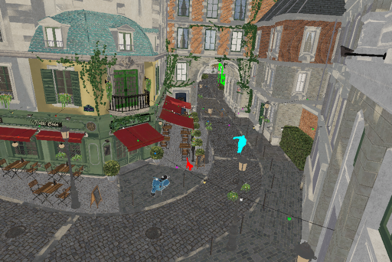

  - 동적 물체 1(Ben): N\_BEN\_WAYPOINTS(11)개의 경유지를 지정하여, 흰색 대저택과 카페를 왕복하도록
    구현했습니다. 이동 중, 호랑이를 마주치면 이동 속도가 빨라지고, 호랑이 반대 방향으로 도망치도록 설정했습니다.

> 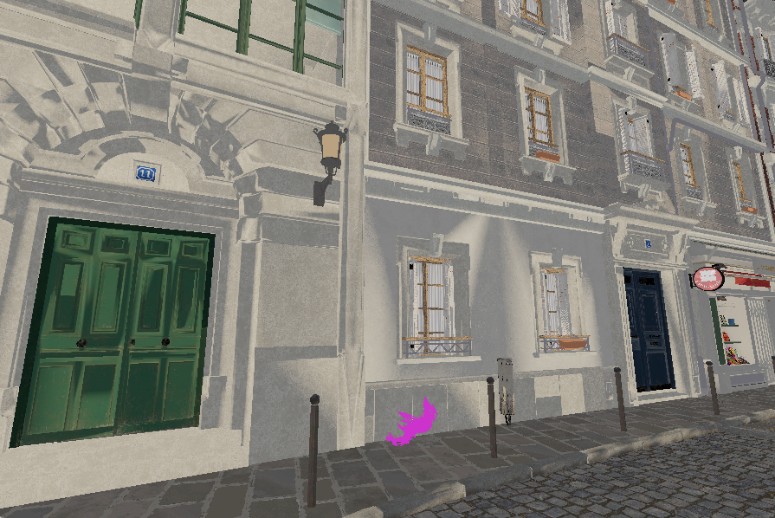

  - 동적 물체 2(거미): 건물 외벽을 타고 올라가다가 일정 높이에 도달하면 바닥으로 떨어지고, 다시 건물을 오르는 사이클을
    반복하도록 구현했습니다.

<!-- end list -->

3.  동적 카메라의 배치 및 조절 기능 구현

<!-- end list -->

1)  호랑이 관점 카메라

<!-- end list -->

  - ‘t’ 키를 누르면 Camera\_t로 전환됩니다. 호랑이의 걸음 주기와 내딛는 발(왼발/오른발)에 맞춰 고개가 자연스럽게
    위아래, 좌우로 움직이는 동작을 표현했습니다.

<!-- end list -->

2)  호랑이 관찰 카메라

> 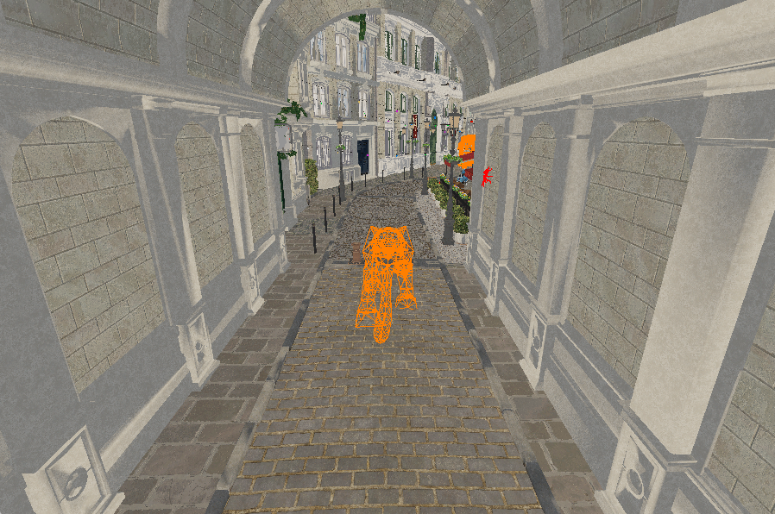

  - ‘g’ 키를 누르면 Camera\_g로 전환됩니다. 카메라의 시선 방향은 항상 호랑이의 위치를 가리키도록 설정했습니다.

<!-- end list -->

4.  종합 통제실의 CCTV 화면의 구현

> 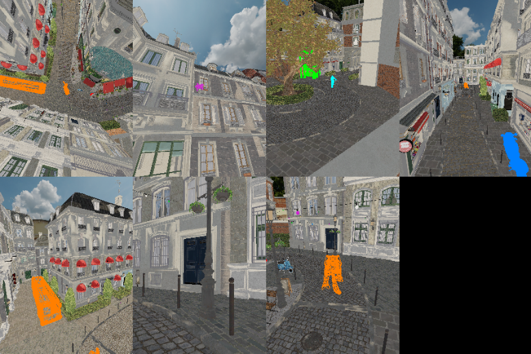

  - Camera\_u, Camera\_i, Camera\_o, Camera\_p, Camera\_a, Camera\_t,
    Camera\_g 7개의 카메라를 분할 화면으로 구성했습니다.

  - ‘c’ 키를 누르면 MODE\_CCTV로 전환되고, 다시 ‘c’ 키를 누르면 이전 카메라 모드로 복귀합니다. 복귀 시 세상
    관찰 카메라의 포즈를 MODE\_CCTV 이전의 상태로 초기화합니다.

  - 세상 관찰 카메라들은 update\_tracking\_cameras() 함수를 호출해 동적 물체를 추적하도록 구현했습니다.
    현재 카메라 시야 내에 있는 동적 물체(호랑이, ben, 거미) 중 카메라에서 가장 가까운 물체를
    tracking\_target으로 설정하고, 해당 물체를 카메라가 추적하도록 했습니다. 추적 중인 물체가 카메라 시야에서
    사라지면 tracking\_target을 초기화하고 카메라를 추적 전 상태로 복귀시킵니다.

<!-- end list -->

5.  추가 기능 구현

> 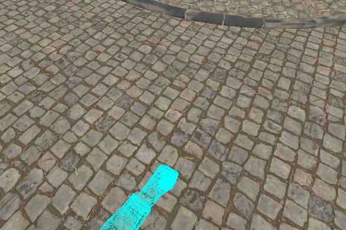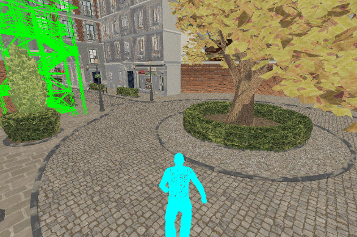

  - ‘m’ 키를 누르면 MODE\_GAME으로 전환됩니다. 게임 모드에서는 마우스 커서를 숨기고, 커서를 화면 중앙에
    고정했습니다.

  - WASD키로 플레이어를 이동하고, 마우스 이동으로 플레이어의 시점을 제어할 수 있도록 구현했습니다.
    PITCH\_MAX(60)으로 상하 시점 범위를 제한했습니다.

  - space를 누르면 플레이어가 점프하며, 공중에서 한 번 더 space를 눌러 2단 점프가 가능하도록 구현했습니다.

  - ‘1’ / ‘3’ 키로 1인칭과 3인칭 시점을 전환할 수 있도록 구현했습니다.

  - 5개의 정적 물체(버스, 타워, 자전거, 개미, 고양이)를 배치하여 플레이어가 물체에 가까이 가면 아이템을 수집하고,
    수집한 아이템을 화면에서 사라지도록 설정했습니다.

  - 플레이어가 이동 중 호랑이에 너무 가까이 접근하면 게임이 초기화되도록 설정했습니다. 5개의 정적 물체를 모두 수집해도
    게임이 초기화되며, 플레이어가 시작 위치로 복귀합니다.

  - 게임 모드에서 ‘r’ 키를 입력받으면 게임이 초기화될 수 있도록 구현했습니다.
