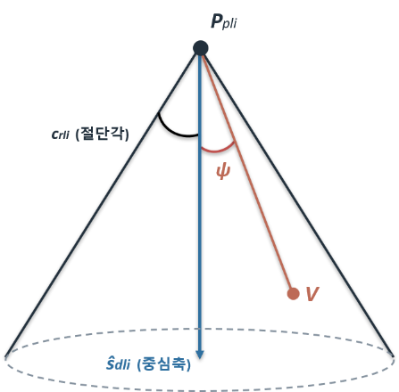
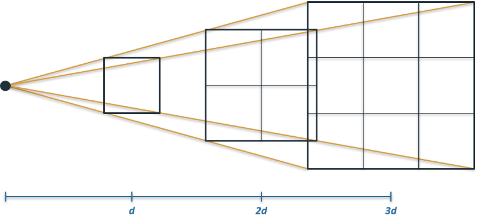

# HW4: OpenGL Lighting Equation 요약 설명

**대상 공식**

```math
c = e_{\text{cm}} + a_{\text{cm}} \cdot a_{\text{cs}}
+ \sum_{i=0}^{n-1} (\text{at}t_{i})(\text{spo}t_{i})
\left\lbrack\, a_{\text{cm}} \cdot a_{\text{cli}}
+ \left( n \odot \overrightarrow{VP_{\text{pli}}} \right) d_{\text{cm}} \cdot d_{\text{cli}}
+ \left( f_{i} \right)\left( n \odot \widehat{h}_{i} \right)^{s_{\text{rm}}} s_{\text{cm}} \cdot s_{\text{cli}} \,\right\rbrack
```

1.  **변수의 의미와 퐁 모델의 확장**

> 공식에 있는 각 변수와 항의 의미는 다음과 같습니다. $`e_{\text{cm}}`$은 물질이 스스로 내는 방사색으로 광원과
> 무관하게 존재합니다. $`a_{\text{cm}} \cdot a_{\text{cs}}`$는 물질 앰비언트 색과 전역 앰비언트 색의
> 곱으로, 특정 광원에 속하지 않는 전역 주변광의 성분입니다. ∑ 안의 항은 $`n`$개 광원 각각이 기여하는 부분으로,
> 광원마다 거리 감쇠 효과 $`\text{at}t_{i}`$와 스폿 광원 효과 $`\text{spo}t_{i}`$가 곱해집니다.
> 대괄호 안의 $`a_{\text{cm}} \cdot a_{\text{cli}}`$는 물질 앰비언트 색과 광원 $`i`$의 앰비언트 색의
> 곱인 광원별 앰비언트,
> $`\left( n \odot \overrightarrow{VP_{\text{pli}}} \right) d_{\text{cm}} \cdot d_{\text{cli}}`$는
> 난반사 항을 의미합니다. $`d_{\text{cm}} \cdot d_{\text{cli}}`$는 물체의 확산 반사율과 광원의 확산광
> 색상의 곱을, $`n \odot \overrightarrow{VP_{\text{pli}}}`$에서 $`n`$은
> 표면의 법선 벡터, $`\overrightarrow{VP_{\text{pli}}}`$는 셰이딩점에서 광원으로 향하는
> 단위벡터(퐁의 L)이므로 $`n \odot \overrightarrow{VP_{\text{pli}}}`$가 $`N \cdot L`$에
> 해당함을 알 수 있습니다. 두 벡터의 내적($`\odot`$)은 음수일 경우에 내적값 대신 0을 사용하는데, 뒤에서
> 들어오는 빛은 고려하지 않음을 의미합니다. 마지막
> $`\left( f_{i} \right)\left( n \odot \widehat{h}_{i} \right)^{s_{\text{rm}}} s_{\text{cm}} \cdot s_{\text{cli}}`$는
> 정반사 항으로, $`\widehat{h}_{i}`$는 광원 방향과 관찰자 방향의 중간 방향으로의 단위벡터인 하프웨이
> 벡터(퐁의 H), $`s_{\text{rm}}`$은 정반사 지수, $`f_{i}`$는 난반사 내적이 양수일 때만
> 1이고 아닐 경우 0인 변수로 정반사도 난반사와 같이 뒤에서 들어오는 빛은 고려하지 않음을 의미합니다.
>
> 이 공식은 퐁의 조명 모델
> $`I = I_{a}k_{a} + I_{d}k_{d}\left( N \cdot L \right) + I_{s}k_{s}\left( N \cdot H \right)^{n}`$을
> 다음과 같이 확장한 것입니다. 단일 밝기 색 대신 색을 RGBA 채널로 확장하고, 물체 스스로 빛을 내는
> 방사항 $`e_{\text{cm}}`$을 추가합니다. 단일 광원이 아니라 독립적인 $`n`$개 광원 각각의 기여를
> 합산해서 계산합니다. 이때 앰비언트를 전역 성분 $`a_{\text{cs}}`$와 광원별
> 성분 $`a_{\text{cli}}`$로 분리하여 구분하고, 광원마다 거리 감쇠 효과 $`\text{at}t_{i}`$와
> 스폿 효과 $`\text{spo}t_{i}`$를 도입합니다. 난반사 내적에서 음수일 경우 내적값 대신 0을 사용해 표면 뒤에서
> 오는 빛을 무시하고, 정반사는 $`f_{i}`$로 제어합니다. 정반사 계산에 하프웨이 벡터 H를 사용하는 Blinn-Phong
> 방식을 사용합니다.

2.  **스폿 광원 효과** $`\mathbf{\text{spo}}\mathbf{t}_{\mathbf{i}}`$ **의 계산**

```math
\text{spo}t_{i} = \begin{cases}
\left( \overrightarrow{P_{\text{pli}}V} \odot \widehat{s}_{\text{dli}} \right)^{s_{\text{rli}}}, & c_{\text{rli}} \neq 180 \ \text{and}\ \overrightarrow{P_{\text{pli}}V} \odot \widehat{s}_{\text{dli}} \geq \cos c_{\text{rli}} \\
0, & c_{\text{rli}} \neq 180 \ \text{and}\ \overrightarrow{P_{\text{pli}}V} \odot \widehat{s}_{\text{dli}} < \cos c_{\text{rli}} \\
1, & c_{\text{rli}} = 180
\end{cases}
```

> 
>
> $`P_{\text{pli}}`$는 스폿 광원의 위치, $`\widehat{s}_{\text{dli}}`$는 스폿 중심축
> 방향, $`c_{\text{rli}}`$는 절단각, $`s_{\text{rli}}`$는 스폿 지수를 나타냅니다. 먼저
> 광원에서 셰이딩점 $`V`$로 향하는 단위벡터 $`\overrightarrow{P_{\text{pli}}V}`$를
> 구하고, 이를 중심축 $`\widehat{s}_{\text{dli}}`$와 내적해 두 벡터의 사잇각 $`\psi`$에
> 대한 $`\cos\psi`$를 구합니다. 이 값으로 다음 세 경우를 구분합니다.
> $`c_{\text{rli}} = 180^{\circ}`$이면 스폿이 아닌 일반 점광원이므로
> $`\text{spo}t_{i}`$는 1입니다. $`c_{\text{rli}} \neq 180^{\circ}`$이고
> $`\cos\psi \geq \cos c_{\text{rli}}`$인 경우는 $`\psi \leq c_{\text{rli}}`$로
> 점이 원뿔 안에 있음을 의미하고, 이 경우
> $`\text{spo}t_{i} = \left( \cos\psi \right)^{s_{\text{rli}}}`$입니다.
> $`\cos\psi < \cos c_{\text{rli}}`$인 경우는 점이 원뿔 밖에 있는 상황이므로
> $`\text{spo}t_{i} = 0`$이 되어 광원이 점에 영향을 주지 않습니다. 지수 $`s_{\text{rli}}`$가
> 클수록 중심축에서 벗어날 때 코사인 거듭제곱에 의해 더 급격히 어두워집니다.

3.  **거리 감쇠 효과** $`\mathbf{\text{at}}\mathbf{t}_{\mathbf{i}}`$ **의 계산**

```math
\text{at}t_{i} = \begin{cases}
\dfrac{1}{k_{0i} + k_{1i} \parallel \overrightarrow{VP_{\text{pli}}} \parallel + k_{2i} \parallel \overrightarrow{VP_{\text{pli}}} \parallel^{2}}, & w(P_{\text{pli}}) \neq 0 \\
1, & \text{otherwise (directional light)}
\end{cases}
```

> 
>
> 실제 광원은 거리가 멀수록 표면에 도달하는 단위 면적당 광량이 줄어듭니다. $`\text{at}t_{i}`$는 실제 광원처럼
> 광원과 셰이딩점 사이 거리 $`d`$에 따라 광원의 기여를 줄이는 계수입니다. 셰이딩점 $`V`$에서 광원
> $`P_{\text{pli}}`$까지의 거리가
> $`d = \parallel \overrightarrow{VP_{\text{pli}}} \parallel`$입니다.
> $`P_{\text{pli}}`$의 $`w \neq 0`$인 경우는 점 광원을 의미하며, 감쇠는 상수, 1차 항, 2차 항의
> 합의 역수로 정의됩니다. 평행 광원은 거리 개념이 없으므로 감쇠가 일어나지 않아
> $`\text{at}t_{i} = 1`$입니다. 감쇠 인자의 기본값은
> $`k_{0i} = 1,\ k_{1i} = k_{2i} = 0`$이어서, 프로그램에서 명시적으로 설정하지 않는 경우 감쇠 효과는 사용되지 않습니다.
