# HW5: OpenGL 기반 쉐이딩, 텍스처 매핑 및 쉐이더 작성 연습

1.  Shaders/Simple\_Phong.frag에 attenuation factor를 추가해 ‘l’키로 모델링 좌표계
    광원을 선택한 상태에서 ‘b’키를 누르면 빛의 감쇄 효과를 켜고 끌 수 있도록 설정했습니다.

> 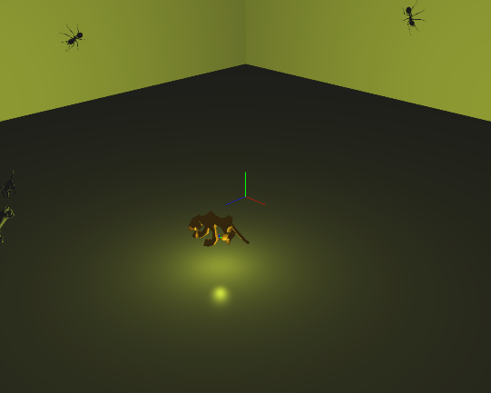
>
> 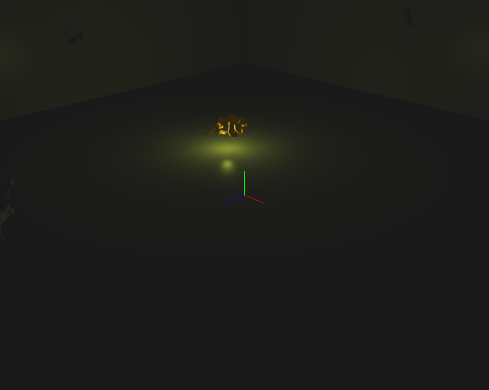

2.  왼쪽 마우스를 누른 상태에서 움직이면 VRP를 카메라의 uv평면 방향으로 평행이동시켜, PRP는 고정한 채로 PRP와
    VRP를 연결한 직선이 회전하도록 구현했습니다.

3.  시선을 움직일 때, 물체들의 EC좌표를 매 프레임 ViewMatrix로 다시 계산해서 쉐이딩이 바뀌도록 구현했습니다. 광원
    위치 프레임 또한 시선 정면에서 시선을 따라 함께 이동하도록 구현했습니다.

4.  ‘l’키로 눈 좌표계 광원을 선택한 상태에서 ‘e’키를 누르면 스폿 방향이 -z방향인 스폿 광원을 토글할 수 있도록
    구현했습니다.

> 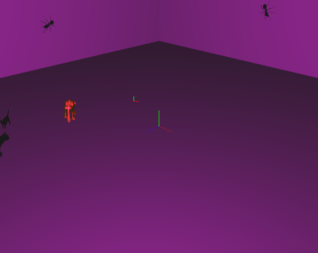
>
> 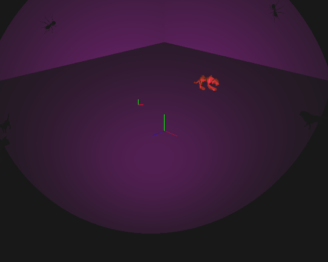

5.  ‘l’키로 세상 좌표계 광원을 선택한 상태에서 ‘d’키를 누르면 광원이 y축을 기준으로 원운동하도록 구현했습니다.

> 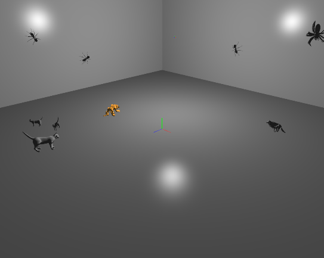
>
> 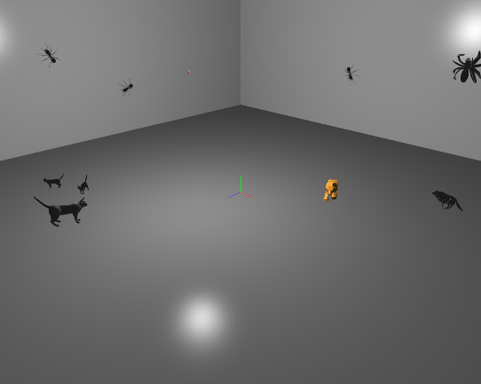

6.  고양이와 개미를 선택하여, 고양이 세 마리는 바닥에, 개미 두 마리는 왼쪽 벽, 한 마리는 오른쪽 벽에 붙어있도록
    배치했습니다.

7.  거미와 늑대를 선택하여, 거미는 오른쪽 벽에서 위아래로 왕복 운동하고, 늑대는 바닥에서 직선으로 왕복하도록 구현했습니다.

8.  ‘f’키를 누르면 My\_glTexImage2D\_from\_file()과 set\_texture\_mapping()을
    사용하여 쉐이더의 u\_flag\_texture\_mapping값에 따라 호랑이를 포함한 물체들에 텍스처를 입히고
    벗길 수 있도록 구현했습니다.

> 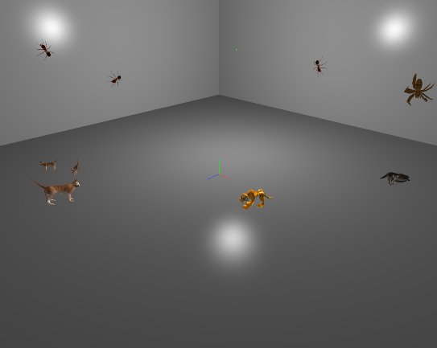

9.  ‘g’키를 누르면 Poly Haven (polyhaven.com)에서 가져온 바닥과 벽 텍스처를 입히고 벗길 수 있도록
    구현했습니다.

> 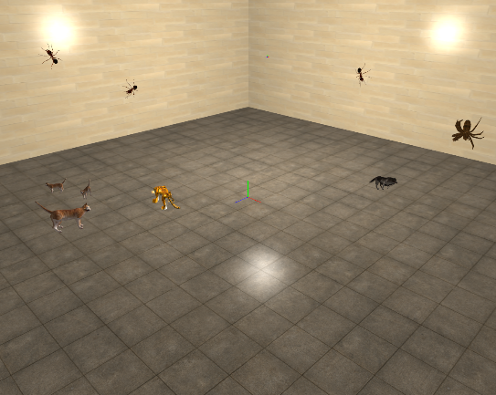

10. ‘h’키를 누르면 호랑이의 블렌딩 효과를 토글하고 ‘i’키와 ‘j’키로 불투명도를 조절할 수 있도록 구현했습니다. 블렌딩
    상태에서는 불투명한 물체들을 모두 그린 뒤 GL\_BLEND를 켜고, glDepthMask를 끄도록 설정했으며,
    불투명도는 쉐이더의 u\_alpha로 조절했습니다.

> 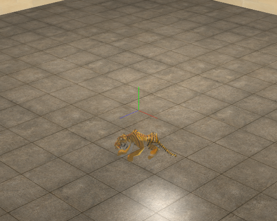

11. 추가 구현

<!-- end list -->

1)  바닥 반사

> ‘r’키를 누르면 물체들이 바닥에 반사될 수 있도록 구현했습니다. prepare\_reflection()에서 반사에 필요한
> 컬러 텍스처(reflection\_texture), 깊이 렌더버퍼(reflection\_depth\_RBO),
> 프레임버퍼(reflection\_FBO)를 생성했습니다. display() 앞부분에서 ViewMatrix를
> y=0 평면 기준으로 대칭시킨 뒤, reflection\_FBO에 물체들을 렌더링하여 반사 텍스처를 만들도록 구현했습니다.
> Simple\_Phong.frag에서 gl\_FragCoord / u\_window\_size로 화면 좌표를 구해
> reflection\_texture를 샘플링하고, 물체가 그려진 곳만 mix로 블렌딩했습니다. 렌더링 시 바닥을 그릴 때에만
> 쉐이더의 u\_flag\_reflection을 켜고, reflection\_texture를 텍스처 유닛 1에 바인딩해
> 물체가 바닥에만 반사되도록 구현했습니다. 거미는 높이에 따라 alpha값을 줄여, 바닥에 가까울 때만 반사될 수
> 있도록 구현했습니다.
> 
> 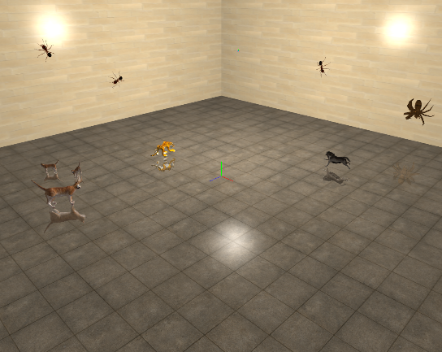

2)  섀도우 매핑

> ‘k’키를 누르면 섀도우 매핑을 토글할 수 있도록 설정했습니다.
> 
> prepare\_shadow()에서 깊이 텍스처(shadow\_map)와 깊이 전용 프레임버퍼(shadow\_FBO)를
> 생성했습니다. display() 앞부분에서 광원 위치에서 원점을 보는 lookAt과 직교 투영으로
> light\_view\_projection\_matrix를 생성했습니다. ViewMatrix와 ProjectionMatrix를
> 광원의 것으로 바꿔 shadow\_FBO에 물체들을 렌더링하여 광원 시점의 깊이를 기록하도록 구현했습니다. 이때
> glPolygonOffset으로 섀도우 bias를 적용했습니다. Simple\_Phong.frag의
> compute\_shadow()에서 Position\_EC를 u\_shadow\_matrix를 통해 광원 공간으로 보낸 뒤
> shadow\_map의 깊이와 3×3 PCF로 비교해 그림자를 판정하고, 직접광 항에만 그림자 계수를 곱하도록 구현했습니다.
> 렌더링 시 u\_shadow\_matrix를 light\_VP × inverse(ViewMatrix)로 설정한 뒤
> shadow\_map을 텍스처 유닛 2에 바인딩했습니다.
> 
> 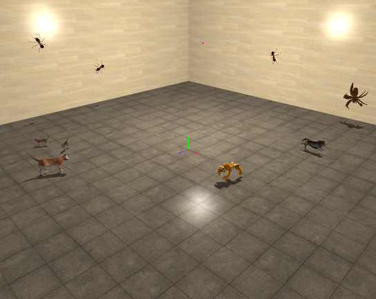
> 
> 반사와 섀도우 매핑을 같이 켜면, 반사 과정에서 u\_shadow\_matrix를 반사된 ViewMatrix 기준으로
> 설정하고, shadow\_map을 적용하여 반사된 물체에도 그림자가 입혀지도록 구현했습니다.
> 
> 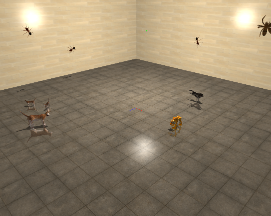
> 
> ‘h’키로 호랑이의 블렌딩을 켠 상태에서는 호랑이의 u\_alpha를 불투명도로 낮추고, 불투명도 비율만큼 픽셀을 dither
> 방식으로 discard해서 호랑이의 불투명도에 따라 반사와 그림자가 조절되도록 구현했습니다.
> 
> 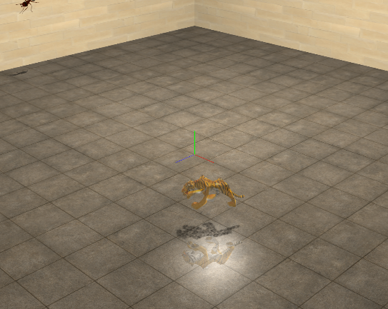
